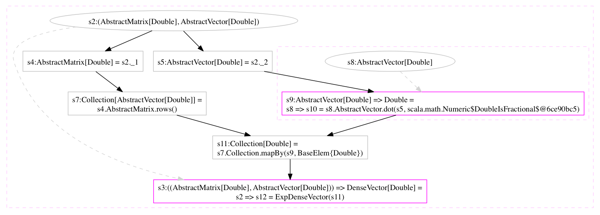

# Scalan's Meta-programming Idioms   

### Intro

Scalan is a framework for development of domain-specific compilers in Scala. In particular it supports meta-programming
based on *staged evaluation*. Visit [Scalan Readme](https://github.com/scalan/scalan/blob/master/README.md) for general
introduction about Scalan and how to get started.

The following is the introduction to meta-programming idioms available in Scalan.

### Idiom 1: Staged Evaluation

*Staged Evaluation* refers to a special mode of program evaluation (or interpretation). Whereas the standard evaluation
*aims to produce output data for a given input data, staged evaluation of program `P` produces graph-based intermediate
*representation of `P`. For example, given a program

```scala
  def mvm(matrix: Matrix[Double], vector: Vector[Double]): Vector[Double] =
    DenseVector(matrix.rows.mapBy(r => r dot vector))
```

its staged evaluation will result in construction of the following graph



Related [code]()

### Idiom 2: Virtualized Code

*Code virtualization* is a systematic program transformation performed manually of automatically by
[Scalanizer](https://github.com/scalan/scalanizer). Thus, after virtualization the following code 

```scala
  def mvm(matrix: Matrix[Double], vector: Vector[Double]): Vector[Double] =
    DenseVector(matrix.rows.mapBy(r => r dot vector))
```

is transformed to 

```scala
  def mvm(matrix: Rep[Matrix[Double]], vector: Rep[Vector[Double]]): Rep[Vector[Double]] =
    DenseVector(matrix.rows.mapBy(fun { r => r dot vector }))
```

Historically, Scalan framework is designed to facilitate easy manual code virtualization as much as it is possible using
standard Scala 2.11 or later compiler. Scalanizer compiler plugin allows to automatically virtualize delimited fragment
of Scala code.

Virtualized code brings us to *"`Rep` types"* and *"Reified lambdas"* idioms of Scalan.

Related [code]()

### Idiom 3: Rep types

The technique was originally introduced in [Polymorphic Embedding](http://dl.acm.org/citation.cfm?id=1449935) and later
developed in [LMS](http://scala-lms.github.io/) staging. It is also known as *lifted embedding* of [Slick
queries](http://slick.typesafe.com/doc/3.1.1/queries.html).

In Scalan, during code virtualization, original types (like `Matrix` and `Vector`) are replaced with Rep types
`Rep[Matrix]` and `Rep[Vector]` correspondingly. Here `Rep` is declared as abstract type

```scala
type Rep[+T]
```

Conside simple example

```scala
val x: Rep[Int] = 10
val y = x + 1 
```

This virtualized code can be evaluated normally by using `ScalanDslStd` context object where `Rep` is defined as the
following

```scala
type Rep[+T] = T
```

```
scala> import scalan._
val ctx = new ScalanDslStd 
import ctx._
val x: Rep[Int] = 10
val y = x + 1
import scalan._

scala> ctx: scalan.ScalanDslStd = $anon$1@5935eb9c
scala> import ctx._
scala> x: ctx.Rep[Int] = 10
scala> y: Int = 11
```

Alternatively, it can be evaluated in *staged mode* by using ScalanDslExp context object where `Rep` is defined as the
following

```scala
type Rep[+T] = Exp[T]
```

Here `Exp` is a type of expressions which are represented by graphs instead of trees
 
```
scala> import scalan._
val ctx = new ScalanDslExp 
import ctx._
val x: Rep[Int] = 10
val y = x + 1
y.showGraph

scala> import scalan._
scala> ctx: scalan.ScalanDslExp = $anon$1@3c72c488
scala> import ctx._
scala> x: ctx.Rep[Int] = s2
scala> y: ctx.Rep[Int] = s4
scala> y.showGraph
```

Note that during staged evaluation each variable contains a symbol of the graph instead of data values.
In a staged context we can visualize any expression as a graph. Showing `y` give us the following graph


### Idiom 4: Reified lambdas 

In standard evaluation when `type Rep[+T] = T` two type terms `Rep[A] => Rep[B]` and `Rep[A => B]` expand to the same
type `A => B`, in staged evaluation (when `type Rep[+T] = Exp[T]`) however they expand to different types `Exp[A] =>
Exp[B]` and `Exp[A => B]` correspondingly.

To understand the difference consider the following example (in staged context)

```scala
scala> 
val ctx = new ScalanDslExp 
import ctx._
val x: Rep[Int] = 10
val inc = (x: Rep[Int]) => x + 1
val y = inc(x)
y.showGraph()

scala> ctx: scalan.ScalanDslExp{val currentPass: this.DefaultPass} = $anon$1@3c72c488
scala> import ctx._
scala> x: ctx.Rep[Int] = s2
scala> inc: ctx.Rep[Int] => ctx.Rep[Int] = <function1>
scala> y: ctx.Rep[Int] = s4
```

Which give us the following graph 

Instances of `Rep[A] => Rep[B]` are ordinary Scala functions from symbols to symbols.

Now consider the following example

```scala
scala> 
val ctx = new ScalanDslExp 
import ctx._
val x: Rep[Int] = 10
val inc = mkLambda({ (x: Rep[Int]) => x + 1 }, mayInline = false)
val y = inc(x)
y.showGraph()

scala> ctx: scalan.ScalanDslExp = scalan.ScalanDslExp@70cf7d1e
scala> import ctx._
scala> x: ctx.Rep[Int] = s2
scala> inc: ctx.Exp[Int => Int] = s4
scala> y: ctx.Rep[Int] = s7
```
Which give us the following graph 


The function `mkLambda` *reifies* the given Scala function and is defined as the following

```scala
def mkLambda[A,B](fun: Rep[A] => Rep[B], mayInline: Boolean)(implicit eA: LElem[A], eB: Elem[B]): Rep[A => B]
```

It works as the following:

- creates a fresh symbol for lambda-bound variable `x` 
- executes argument `fun` using the fresh symbol, computing resulting symbol `y`
- stores symbols `x` and `y` in special graph node `Lambda(x,y)`
- add `Lambda` node to the graph and returns its symbol as result
