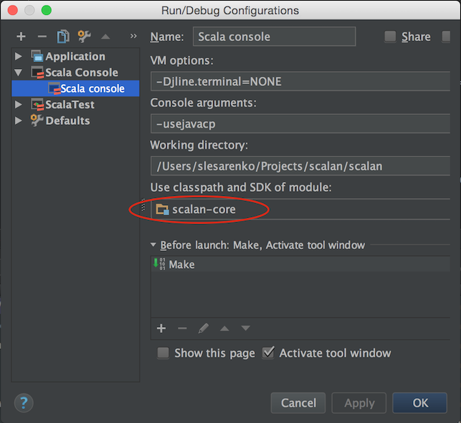
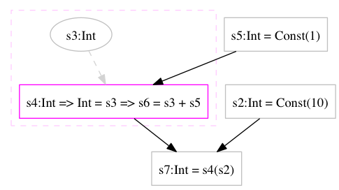
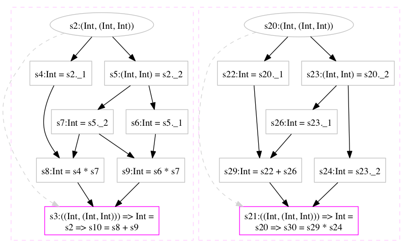
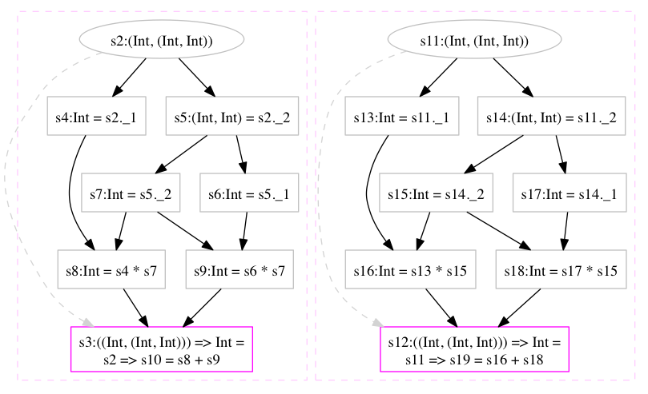
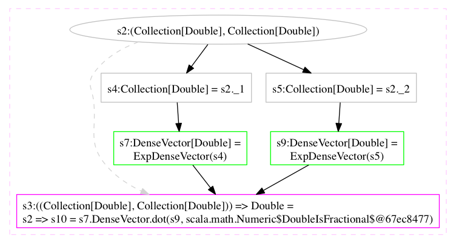

# Scalan's Meta-programming Idioms   

### Table of contents
- [Introduction](#introduction)
- [Staged Evaluation](#Idiom1)
- [Virtualized Code](#Idiom2)
- [Rep types](#Idiom3)
- [Reified lambdas](#Idiom4)
- [Rewrite rules](#Idiom5)
- [Staged transformation by re-evaluation](#Idiom6)

### Introduction

Scalan is a framework for development of domain-specific compilers in Scala. In particular it supports meta-programming
based on *staged evaluation*. Visit [Scalan Readme](https://github.com/scalan/scalan/blob/master/README.md) for general
introduction about Scalan and how to get started.

The following is the introduction to meta-programming idioms available in Scalan along with example REPL sessions to try
them yourself. The core of Scalan (`scalan-core` module) is application neurtal and generic, thus all the idioms are in
principle applicable to any user domain. See [example applications](applications.md) of Scalan for variuos domains. 

To run all the RERL examples youself you can use your favorit Scala Console. 
The examples are tested with SBT Scala console and Scala Console Run Configuration of IntelliJ IDEA 14.x.
In SBT you may need to switch to scalan-core project like it is shown below.

```
$ sbt
[info] Loading project definition from /Users/slesarenko/Projects/scalan/scalan/project
[info] Set current project to scalan (in build file:/Users/slesarenko/Projects/scalan/scalan/)
> project scalan-core
[info] Set current project to scalan-core (in build file:/Users/slesarenko/Projects/scalan/scalan/)
> console
[info] Starting scala interpreter...
[info]
Welcome to Scala version 2.11.7 (Java HotSpot(TM) 64-Bit Server VM, Java 1.8.0_60).
Type in expressions to have them evaluated.
Type :help for more information.
scala> import scalan._
import scalan._
scala>
```

In IDEA run configuration select scalan-core module as shown below



<a name="Idiom1"></a> 
### Idiom 1: Staged Evaluation 

*Staged Evaluation* refers to a special mode of program evaluation (or interpretation). Whereas standard evaluation
aims to produce output data for given input data, staged evaluation of program `P` produces graph-based intermediate
representation of `P`. For example, given a program

```scala
  def mvm(matrix: Matrix[Double], vector: Vector[Double]): Vector[Double] =
    DenseVector(matrix.rows.mapBy(r => r dot vector))
```

its staged evaluation will result in construction of the following graph


Related [code]()

<a name="Idiom2"></a>
### Idiom 2: Virtualized Code

*Code virtualization* is a systematic program transformation performed manually of automatically by
[Scalanizer](https://github.com/scalan/scalanizer). Thus, after virtualization the following code 

```scala
  def mvm(matrix: Matrix[Double], vector: Vector[Double]): Vector[Double] =
    DenseVector(matrix.rows.mapBy(r => r dot vector))
```

is transformed to 

```scala
  def mvm(matrix: Rep[Matrix[Double]], vector: Rep[Vector[Double]]): Rep[Vector[Double]] =
    DenseVector(matrix.rows.mapBy(fun { r => r dot vector }))
```

Historically, Scalan framework is designed to facilitate easy manual code virtualization as much as it is possible using
standard Scala 2.11 or later compiler. Scalanizer, compiler plugin, allows to automatically virtualize delimited
fragment of Scala code.

Virtualized code brings us to *"`Rep` types"* and *"Reified lambdas"* idioms of Scalan.

Related [code]()

<a name="Idiom3"></a> 
### Idiom 3: Rep types

The technique was originally introduced in [Polymorphic Embedding](http://dl.acm.org/citation.cfm?id=1449935) and later
developed in [LMS](http://scala-lms.github.io/) staging. It is also known as *lifted embedding* of [Slick
queries](http://slick.typesafe.com/doc/3.1.1/queries.html).

In Scalan, during code virtualization, original types (like `Matrix` and `Vector`) are replaced with Rep types
`Rep[Matrix]` and `Rep[Vector]` correspondingly. Here `Rep` is declared as abstract type

```scala
type Rep[+T]
```

Consider simple example

```scala
val x: Rep[Int] = 10
val y = x + 1 
```

This virtualized code can be evaluated normally by using `ScalanDslStd` context object where `Rep` is defined as the
following

```scala
type Rep[+T] = T
```

```
scala> import scalan._
val ctx = new ScalanDslStd 
import ctx._
val x: Rep[Int] = 10
val y = x + 1
import scalan._

scala> ctx: scalan.ScalanDslStd = $anon$1@5935eb9c
scala> import ctx._
scala> x: ctx.Rep[Int] = 10
scala> y: Int = 11
```

Alternatively, it can be evaluated in *staged mode* by using ScalanDslExp context object where `Rep` is defined as the
following

```scala
type Rep[+T] = Exp[T]
```

Here `Exp` is a type of expressions which are represented by graphs instead of trees
 
```
scala> import scalan._
val ctx = new ScalanDslExp 
import ctx._
val x: Rep[Int] = 10
val y = x + 1
y.show()

scala> import scalan._
scala> ctx: scalan.ScalanDslExp = $anon$1@3c72c488
scala> import ctx._
scala> x: ctx.Rep[Int] = s2
scala> y: ctx.Rep[Int] = s4
scala> y.show()
```

Note that during staged evaluation each value of the type `Rep` contains a symbol of the graph instead of data values.
In a staged context we can visualize any expression as a graph. Showing `y` give us the following graph


<a name="Idiom4"></a> 
### Idiom 4: Reified lambdas 

In standard evaluation (when `type Rep[+T] = T`) two type terms `Rep[A] => Rep[B]` and `Rep[A => B]` expand to the same
type `A => B`, in staged evaluation however (when `type Rep[+T] = Exp[T]`) they expand to different types `Exp[A] =>
Exp[B]` and `Exp[A => B]` correspondingly.

To understand the difference consider the following example (in staged context)

```scala
scala> 
val ctx = new ScalanDslExp 
import ctx._
val x: Rep[Int] = 10
val inc = (x: Rep[Int]) => x + 1
val y = inc(x)
y.show()

scala> ctx: scalan.ScalanDslExp = $anon$1@3c72c488
scala> import ctx._
scala> x: ctx.Rep[Int] = s2
scala> inc: ctx.Rep[Int] => ctx.Rep[Int] = <function1>
scala> y: ctx.Rep[Int] = s4
```

Which give us the following graph 


Instances of `Rep[A] => Rep[B]` are ordinary Scala functions from symbols to symbols.

Now consider the following example

```scala
scala> 
val ctx = new ScalanDslExp 
import ctx._
val x: Rep[Int] = 10
val inc = mkLambda({ (x: Rep[Int]) => x + 1 }, mayInline = false)
val y = inc(x)
y.show()

scala> ctx: scalan.ScalanDslExp = scalan.ScalanDslExp@70cf7d1e
scala> import ctx._
scala> x: ctx.Rep[Int] = s2
scala> inc: ctx.Exp[Int => Int] = s4
scala> y: ctx.Rep[Int] = s7
```
Which give us the following graph 



The function `mkLambda` *reifies* the given Scala function and is defined as the following

```scala
def mkLambda[A,B](fun: Rep[A] => Rep[B], mayInline: Boolean)(implicit eA: LElem[A], eB: Elem[B]): Rep[A => B]
```

It works in four steps:

- creates a fresh symbol for lambda-bound variable `x` 
- executes argument `fun` using the fresh symbol, computing resulting symbol `y`
- stores symbols `x` and `y` in special graph node `Lambda(x,y)`
- add `Lambda` node to the graph and returns its symbol as result

<a name="Idiom5"></a> 
### Idiom 5: Rewrite rules 

Staged evaluation of virtualized code produces a graph-based data structure, step by step adding operations (as nodes)
to the resulting graph. For each new node added to the graph a set of rewrite rules is exercised for applicability.

Conceptually, the set of rewrite rules is a partial function, which can optionally replace the symbol into new symbol.

```scala
def rewrite[A](x: Exp[A]): Option[Exp[A]]
``` 

This function is called for each new node of the graph during staged evaluation. If `rewrite` returns `Some(symbol)`
then this symbol substitutes the original symbol in further evaluation process.

The effect of rewriting is shown in the following REPL session

```scala
import scalan._
val ctx = new ScalanDslExp
import ctx._
val calc = fun { (in: Rep[(Int, (Int, Int))]) =>
  val Pair(a, Pair(b, c)) = in
  a * c + b * c
}

def lemma = postulate { (a: Rep[Int], b: Rep[Int], c: Rep[Int]) =>
  a * c + b * c  <=> (a + b) * c
}
val rw = new RulesRewriter(List(patternRewriteRule(lemma)))
val calcOpt = ProgramGraph.transform(calc, rw)
showGraphs(calc, calcOpt)

scala> ctx: scalan.ScalanDslExp = scalan.ScalanDslExp@350bbd5d
scala> import ctx._
scala> calc: ctx.Rep[((Int, (Int, Int))) => Int] = s3
scala> lemma: ctx.RRewrite[Int]
scala> rw: ctx.RulesRewriter = scalan.primitives.RewriteRulesExp$RulesRewriter@7a9dfe2c
scala> calcOpt: ctx.Rep[((Int, (Int, Int))) => Int] = s21
```

Which outputs the following graphs for `calc` and `calcOpt` functions



Method `transform` takes the root symbol of the graph and some rewriter and produces a new graph by *staged re-evaluation*
of the original graph (see [idiom 6](#Idiom6)). It tries to rewrite each node of the new graph.

```scala
def transform[A](s: Exp[A], rw: Rewriter = NoRewriting, t: MapTransformer = MapTransformer.Empty): Exp[A]
```

There are many different ways to define rewriters in Scalan:

- by specifying first-class rules with `postulate`
- by using Scala's `PartialFunction[Exp[_], Exp[_]]` 
- by direct implementation of `Rewriter` interface or inheriting from one of the helper classes

Rules can also be associated with compilation phases (see *[Staged transformation by re-evaluation](#Idiom6)* idiom).


<a name="Idiom6"></a> 
### Idiom 6: Staged transformation by re-evaluation

As shown in [Idiom 3](#Idiom3), one way to build graph in Scalan is to execute virtualized code in staged mode (perform
staged evaluation). Here we consider an alternative. Every graph can be *re-evaluated* or traversed in topoligical order
visiting nodes with respect to the data-flow dependencies of IR. This formally connects re-evaluation to the semantics
of the language and, in a sence, equivalent to staged evaluation of the original code. More formally this is described
in our [paper]().

Each visited node of the original graph is cloned and added under fresh symbol (identifier) to the *sea-of-nodes-like*
universe of Symbol -> Definition dictionary pairs. The mapping between original and cloned nodes is stored during
traversal and is used to keep relationship between cloned nodes. This can be thought of as if the original edges are
also cloned to the edges between the cloned nodes.

It is better illustrated by the following REPL

```scala
import scalan._
val ctx = new ScalanDslExp
import ctx._
val calc = fun { (in: Rep[(Int, (Int, Int))]) =>
  val Pair(a, Pair(b, c)) = in
  a * c + b * c
}

val calcClone = ProgramGraph.transform(calc, NoRewriting)
showGraphs(calc, calcClone)

scala> ctx: scalan.ScalanDslExp = scalan.ScalanDslExp@350bbd5d
scala> import ctx._
scala> calc: ctx.Rep[((Int, (Int, Int))) => Int] = s3
scala> calcClone: ctx.Rep[((Int, (Int, Int))) => Int] = s12
```

Which outputs the following graphs for `calc` and `calcClone` functions



Note, the two graphs are what is called *alpha-equivalent*, they equal up to renaming of their symbols. Thus,
`transform` without rewriting (more precisely with `NoRewriting` rewriter) can be considered as identity transformation
because it produces a new graph, which is alpha-equivalent to the original.

Staged Transformation by re-evaluation idiom allows to implementent [multi-stage compilation pipeline](#Idiom).

<a name="Idiom7"></a> 
### Idiom 7: Type Virtualization 

Besides Scala expressions [Code Virtualization](#Idiom2) is also defined for types. Consider the following example. 

```scala
trait Segment { 
  def start: Int
  def length: Int
  def end: Int
  def shift(ofs: Int): Segment
}
case class Interval(start: Int, end: Int) extends Segment {
  def length = end - start
  def shift(ofs: Int) = new Interval(start + ofs, end + ofs)
}
``` 
See [source code]()

Its virtualized version is the following

```scala
trait Segment extends Def[Segment] { self =>
  def start: Rep[Int]
  def length: Rep[Int]
  def end: Rep[Int]
  def shift(ofs: Rep[Int]): Rep[Segment]
}
abstract class Interval(val start: Rep[Int], val end: Rep[Int]) extends Segment {
  def length = end - start
  def shift(ofs: Rep[Int]) = Interval(start + ofs, end + ofs)
}
``` 

This transformation is systematic and can be performed either manually or by Scalanizer compiler plugin.

- every trait should directly or indirectly inherit `Def` 
- all method signatures are virtualized using `Rep` type constructor
- `case class` becomes `abstract class`
- object instantiation with `new` is replaced with the *factory-like* instantiation.

This virtualized snippet of code is complemented with boilerplate code generated by `scalan.meta.BoilerplateTool`. The
tool parses this virtualized snippet and produces all the necessary boilerplate. With some limitations, type
virtualization works for a rather rich subset of Scala including trait hierarchies, generic (polymorphic) types and
high-kind type parameters.

Moreover, type virtualization is also used by the Scalan framework internally to implement [First-class
Isomorphisms](#Idiom10) and [First-class Converters](#Idiom11).

<a name="Idiom8"></a> 
### Idiom 8: Staged Method Invocation

Type vitualization brings us to the question of how to perform staged evaluation of method calls.
Consider the following example of staged evaluation of the virtualized code involing method call (`dot` method)

```scala
import scalan._
import scalan.collections._
import scalan.linalgebra._
val ctx = new MatricesDslExp {}
import ctx._
val vvm = fun { p: Rep[(Collection[Double], Collection[Double])] =>
  val Pair(items1, items2) = p
  val v1 = DenseVector(items1)
  val v2 = DenseVector(items2)
  v1.dot(v2)
}
showGraphs(vvm)
```


By default, all method calls are reified in the graph as nodes using the following type (visualized in a more
user-friendly form)

```scala
case class MethodCall(receiver: Exp[_], method: Method, args: List[AnyRef], neverInvoke: Boolean)
                     (val selfType: Elem[Any]) extends Def[Any] 
```


